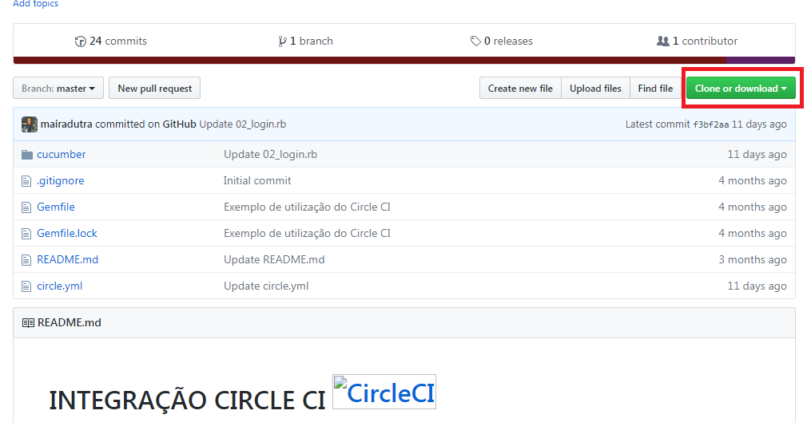

## Mobral GitHub ##

Você caiu nessas páginas pelo Google,  leu e releu os readme.md e ainda não sabe como usar esse site?
Talvez seus problemas acabem agora, talvez você arrume mais alguns, mas a ideia desse guia é tentar ajudar a sobreviver ao GitHub.

#Começando: o que é GitHub?

É um site que permite que você hospede seus projetos. Ok, mas para que eu vou querer deixar meus projetos hospedados aí? Porque outras pessoas podem ver seus projetos, baixá-los, olhar o seu código… E você também pode ver o código dos outros, participar de projetos e seguir outros desenvolvedores.
Hum.. Isso soa como uma rede social. É isso mesmo? É, praticamente. E o melhor é que você pode seguir a galera super foda da sua área, tentar interagir, aprender muitas coisas e sem precisar emitir sua opinião sobre política e futebol, como faz la na rede social do tio Mark.

Entendi, mas:

#E como eu faço para usar essa resposta da busca que o Google me deu?

Primeiro você lerá mesmo o README.md, do projeto. O  README.md é o arquivo de “apresentação” do projeto. Ele contem as informações sobre a estrutura,que enfatizam a lista de funcionalidades, o que ele faz e, o mais importante, como ele pode te ajuda.

Lido o README.md, entendido um pouco sobre o projeto, vamos aprender como usar o projeto:

a) Ou você faz o download e se vira:

  

b) Ou você faz do jeito chique de ser e começa a aprender =):

1. Clique no botão Clone ou Download, da imagem acima

2. Copie o link que aparecer na mensagem:

  

3. Abra o prompt de comando que você usa (Se você não usa nenhum, clique no botão inciar e digite cmd no campo de pesquisa) e clone o projeto em uma pasta de sua preferência com o comando:

  ```
      git clone https://github.com/mairadutra/circle_ci_exemplo.git
  ```
Pronto! Agora o projeto está na pasta. Sorria e vá aprender o que ele te ensina.

#Mas e se eu quiser aprender mais?

Ótima escolha! Vamos começar, logicamente, pelo começo:

#Criando uma conta:

Para criar sua conta no Github acesse:

[GitHub](http://github.com)

Preencha os campos: *usermane*, *e-mail address* e *password* com as suas informações.

Clique em *Create an Account*.

E Pronto! Você já tem uma conta!

#Registrando sua máquina:
Já que você tem uma conta, vamos contar para o Github qual máquina você usará para subir seus códigos para lá.

Vamos novamente ao prompt de comando para configurar tudo:

1. Vamos gerar uma chave SSH que será utilizada por sua máquina para ter autorização do GitHub.

Digite o seguinte comando:

```
    ssh-keygen -t rsa -b 4096 -C "seu_email@dominio.com"  
```
Lembre de trocar o e-mail para o seu e-mail cadastrado no GitHub.

O resultado será:
```
  Generating public/private rsa key pair.  
  Enter file in which to save the key (/Users/you/.ssh/id_rsa): [Press enter]  
```

Só que será no seu **nome de usuário** onde está: *Users/you*

2. Aí ele pedirá para cadastrar uma senha:
```
  Enter passphrase (empty for no passphrase): [Type a passphrase]  
  Enter same passphrase again: [Type passphrase again]  
```
Só se lembre que essa senha você  terá que digitar toda vez que for baixar algo de um repositório ou enviar algo para seu repositório.  Guarde-a com carinho.

3. Depois, conte ao ssh- agente que já temos uma chave de autorização:

  a) Primeiro ative-o: ``` ssh-agent -s  ```

	b) Depois adicione a chave a ele: ``` ssh-add ~/.ssh/id_rsa  ```

Se não der certo,  com plano B, acesse sua pasta de usuário (C:\Users\seuusuario\.ssh), abra o arquivo id_rsa.pub com o notepad++ e copie seu conteúdo.

4. Por fim, vamos contar para nossa conta do GitHub que temos a chave para nossa máquina:

	a) Acesse a opção de configurações da sua conta:

    

  b) No menu lateral esquerdo, escolha a opção SSH and GPG Keys e depois clique no botão New SSH key:

    

  c) Volte ao prompt e digite o seguinte comando para copiar sua chave:

  ```
      clip < ~/.ssh/id_rsa.pub  
  ```

 d) Em Title, digite um nome para sua máquina e em Key, cole a chave copiada.

    

 e) Clique em Add SSH Key e tudo pronto. Podemos, finalmente, criar nosso próprio
  repositório.

#Criando um repositório para seu código

Como já temos conta e  máquina autorizada, falta  só criar um repositório para seu projeto:

1. Clique no *+* na barra de menu do GitHub e escolha *New repository*

  

2. Preencha os campos como na imagem abaixo e clique em *Create repository*

  

#Subindo os arquivos

Com o repositório criado, já podemos mandar arquivos para ele.

Lembra de como que clona o projeto lá dos passos iniciais? Então, clone seu novo repositório em uma pasta qualquer.

Feito isso, crie um arquivo teste.txt na pasta em que seu repositório foi clonado.

Daí, volte ao prompt para enviar esse arquivo para o GitHub:

1. No prompt, entre na  pasta onde o repositório foi clonado

2. Digite o comando para adicionar arquivos:

```
    git add .
```

3. Em seguida faça o commit:

```
    git commit – m 'descrição do commit'
```
Lembre-se de trocar a *'descrição do commit'* para uma mensagem que faça sentido para o seu projeto.

4. Por fim o push:

```
    git push
```

5. Será solicitado seu login e senha do GitHub. Faça o login com seu nome de usuário e a senha criada para subir arquivos.

E Pronto! Você aprendeu o mobral para o GitHub.
